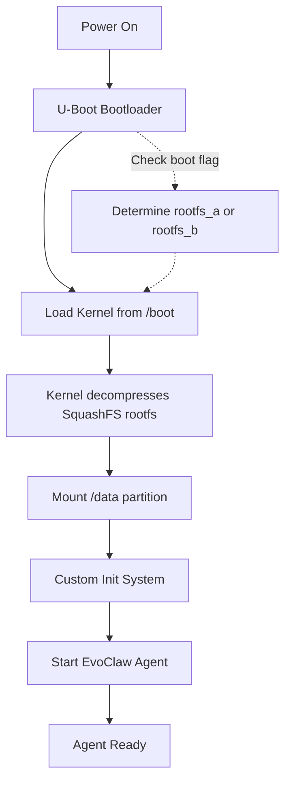
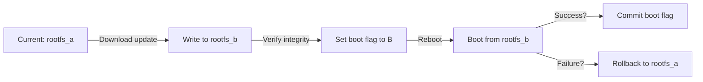
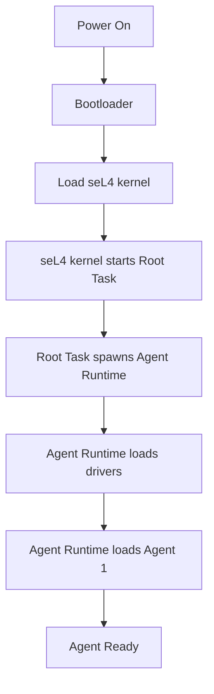

# ClawOS Architecture

Technical design and implementation details for ClawOS.

---

## Overview

ClawOS evolves through three phases:

1. **ClawOS Lite:** Minimal Linux distro (Buildroot/Yocto) — ~30MB, boots in <2s
2. **ClawOS Core:** Custom microkernel OS (seL4-based) — <5MB, boots in <500ms  
3. **ClawOS Full:** Distributed agent mesh + ClawChain integration — 2027+

This document focuses on **Lite** (near-term) and **Core** (medium-term).

---

## ClawOS Lite Architecture

### Design Goal
A **minimal Linux distribution** that boots fast, runs small, and supports EvoClaw agents with zero bloat.

### Technology Stack

**Build system:**
- **Buildroot** (primary) — simple, reproducible, well-documented
- **Yocto/OpenEmbedded** (alternative) — more flexible, steeper learning curve

**Kernel:**
- **Custom Linux kernel** (6.x LTS)
- Compiled with only needed drivers (no modules)
- Minimal configuration (no desktop, graphics, unnecessary subsystems)
- Typical size: **2-4 MB** compressed

**Userland:**
- **Busybox** — single binary with common Unix tools (~500 KB)
- **No systemd** — custom agent-first init system (~50 KB)
- **No GNU coreutils** — Busybox provides all we need

**Pre-installed software:**
- **EvoClaw agent runtime** (Node.js or native binary)
- **Mosquitto** — lightweight MQTT broker (~200 KB)
- **ALSA + PipeWire** — audio stack for companion agents (~2 MB)
- **wpa_supplicant** — WiFi support (~500 KB)
- **Dropbear** — minimal SSH server (~200 KB, optional for debugging)

**Total image size:** ~30 MB (compressed), ~80 MB uncompressed.

---

### Filesystem Layout

ClawOS Lite uses a **three-partition scheme** for safe OTA updates:

```
┌──────────────────────────────────────┐
│  /boot (FAT32, 64 MB)                │  Bootloader, kernel, device tree
├──────────────────────────────────────┤
│  /rootfs_a (SquashFS, 30 MB)         │  Read-only system partition (active)
├──────────────────────────────────────┤
│  /rootfs_b (SquashFS, 30 MB)         │  Read-only system partition (inactive)
├──────────────────────────────────────┤
│  /data (ext4, remaining space)       │  Writable agent data + genomes
└──────────────────────────────────────┘
```

**Why SquashFS for rootfs?**
- **Compressed** — saves 50-70% space
- **Read-only** — can't be corrupted by bad writes
- **Fast boot** — decompresses on-the-fly, no separate initramfs

**Why A/B partitions?**
- **Safe OTA updates** — download to inactive partition, atomically switch on reboot
- **Rollback** — if new image fails to boot, bootloader reverts to old partition
- **Never brick** — always have a working image

**Data partition:**
- **EvoClaw agent genomes** (evolving code)
- **Agent state** (memories, learned behaviors)
- **Configuration** (network settings, API keys)
- **Logs** (rotated daily)

---

### Boot Flow

ClawOS Lite boots in **under 2 seconds** on Raspberry Pi Zero 2W:



**Detailed boot sequence:**

1. **U-Boot (100ms):**
   - Initialize hardware (RAM, storage, network)
   - Check boot flag → select `rootfs_a` or `rootfs_b`
   - Load kernel + device tree into RAM
   - Jump to kernel

2. **Kernel init (500ms):**
   - Initialize core subsystems (scheduler, memory, drivers)
   - Mount `/rootfs_a` (or `_b`) as root
   - Mount `/data` as `/var/agent`
   - Execute `/sbin/init` (our custom init system)

3. **Custom Init (200ms):**
   - Set hostname, timezone
   - Configure network (WiFi or Ethernet)
   - Start MQTT broker (Mosquitto)
   - Start audio stack (ALSA/PipeWire)
   - Execute `/usr/bin/evoclaw-agent` (the agent runtime)

4. **EvoClaw Agent (500ms):**
   - Load genome from `/var/agent/genomes/current`
   - Initialize persona (memories, personality)
   - Connect to MQTT broker
   - Start listening (audio, sensors, network)

**Total: ~1.3 seconds** from power-on to agent-ready.

*(Optimizations can push this under 1 second on faster hardware.)*

---

### Custom Init System

ClawOS replaces **systemd** (3 MB, complex) with a **simple agent-first init** (~50 KB).

**Why not systemd?**
- **Too heavy** — 3 MB binary, hundreds of dependencies
- **Too complex** — units, targets, timers, slices, scopes...
- **Wrong abstraction** — designed for services, not agents

**Custom init responsibilities:**

1. **Mount filesystems** (`/proc`, `/sys`, `/dev`, `/data`)
2. **Configure network** (WiFi via wpa_supplicant or Ethernet)
3. **Set system parameters** (hostname, timezone, locale)
4. **Start MQTT broker** (Mosquitto)
5. **Start audio stack** (ALSA/PipeWire)
6. **Launch EvoClaw agent** (PID 2 or higher, init monitors it)
7. **Reap zombies** (wait for dead children)
8. **Handle signals** (shutdown, reboot)

**Implementation:** Simple C program (~500 LOC) or Rust (~800 LOC).

**Example flow:**
```c
int main() {
    mount_filesystems();
    configure_network();
    start_mqtt_broker();
    start_audio_stack();
    
    pid_t agent_pid = fork();
    if (agent_pid == 0) {
        execve("/usr/bin/evoclaw-agent", ...);
    }
    
    // Monitor agent, restart if crashes
    while (1) {
        int status;
        pid_t died = wait(&status);
        if (died == agent_pid) {
            // Agent crashed, restart it
            agent_pid = fork_and_exec_agent();
        }
    }
}
```

---

### OTA Update System

ClawOS Lite supports **over-the-air updates** for both the OS and agent genomes.

#### OS Updates (A/B Partitioning)



**Process:**

1. **Agent receives OTA notification** (via MQTT or HTTP)
2. **Download new image** to inactive partition (`rootfs_b`)
3. **Verify signature** (cryptographic signature from developer)
4. **Write boot flag** (U-Boot environment variable: `bootpart=b`)
5. **Reboot** → U-Boot loads from `rootfs_b`
6. **Watchdog timer** → if agent doesn't start in 60s, reboot to `rootfs_a`
7. **Commit** → agent confirms success, U-Boot makes `bootpart=b` permanent

**Rollback safety:**
- If new image fails to boot, U-Boot automatically reverts after 3 attempts
- If agent crashes repeatedly, init system can trigger rollback

#### Genome Updates (Agent Code)

Agent genomes live in `/var/agent/genomes/`:

```
/var/agent/
├── genomes/
│   ├── current -> v1.2.3/
│   ├── v1.2.3/
│   │   ├── genome.js
│   │   └── signature.sig
│   ├── v1.2.4/  (downloaded, ready to activate)
│   │   ├── genome.js
│   │   └── signature.sig
├── memories/
│   └── ...
└── config/
    └── ...
```

**Hot-swap process:**

1. **Download new genome** to `/var/agent/genomes/v1.2.4/`
2. **Verify signature** (ensures genome is from trusted developer)
3. **Symlink update** → `current -> v1.2.4`
4. **Reload agent** (send SIGHUP to agent process, it reloads genome)
5. **Test** → if crashes, revert symlink to `v1.2.3`

**No reboot required** — agents evolve in place.

---

### Hardware Abstraction Layer (HAL)

ClawOS provides a **unified API** for hardware access, so agents work across platforms.

#### HAL Architecture

```
┌─────────────────────────────────────┐
│   EvoClaw Agent (JavaScript/Rust)   │
├─────────────────────────────────────┤
│   ClawOS HAL (Unix-like API)        │
├─────────────────────────────────────┤
│   Platform Drivers (ALSA, V4L2, GPIO)│
├─────────────────────────────────────┤
│   Hardware (Mic, Speaker, Camera, LED)│
└─────────────────────────────────────┘
```

**HAL API (simplified):**

```javascript
// Audio input (microphone)
const mic = claw.audio.openInput({ sampleRate: 16000, channels: 1 });
mic.on('data', (buffer) => { /* process audio */ });

// Audio output (speaker)
const speaker = claw.audio.openOutput({ sampleRate: 48000, channels: 2 });
speaker.write(audioBuffer);

// Camera (still image or video)
const camera = claw.camera.open({ resolution: '1920x1080', fps: 30 });
const image = camera.capture(); // Buffer or file path

// GPIO (LEDs, buttons, sensors)
const led = claw.gpio.openPin(17, 'output');
led.write(1); // Turn on LED

const button = claw.gpio.openPin(27, 'input', { pull: 'up' });
button.on('press', () => { /* handle button */ });

// I2C/SPI (custom sensors)
const sensor = claw.i2c.open(0x48); // Temperature sensor at address 0x48
const temp = sensor.read(0x00); // Read register 0x00
```

**Backend implementations:**
- **Audio:** ALSA (low-level) or PipeWire (higher-level, routing)
- **Camera:** V4L2 (Video4Linux2) or libcamera
- **GPIO:** `/sys/class/gpio` or `libgpiod`
- **I2C/SPI:** `/dev/i2c-*`, `/dev/spidev*`

**Cross-platform support:**
- Raspberry Pi: Full HAL support (audio, camera, GPIO)
- ESP32-S3: Future, requires ClawOS Core (microkernel)
- x86: Limited (audio yes, GPIO/camera depends on hardware)

---

## ClawOS Core Architecture (Future)

### Design Goal
A **custom microkernel OS** that boots in <500ms, runs in <5MB, and provides agent-native abstractions.

### Why Microkernel?

**Traditional monolithic kernels (Linux):**
- All drivers, filesystems, networking **inside kernel**
- Bug in driver = kernel crash
- Large trusted codebase (~20M LOC for Linux)

**Microkernel design:**
- Kernel only provides: **IPC, scheduling, memory management**
- Everything else runs in **userspace** (drivers, filesystems, even agent runtime)
- Bug in driver = driver crashes, kernel keeps running
- Small trusted codebase (~10K LOC for seL4)

**Benefits for ClawOS:**
- **Security:** Minimal attack surface
- **Reliability:** Faults isolated to userspace
- **Formal verification:** seL4 is mathematically proven correct
- **Agent isolation:** Each agent in separate address space

---

### seL4 Foundation

ClawOS Core is based on **seL4**, the world's first (and only) OS kernel with a **formal correctness proof**.

**seL4 guarantees:**
- **Memory safety** — no buffer overflows, use-after-free, etc.
- **Capability-based access control** — no ambient authority
- **Isolation** — agent A cannot access agent B's memory without explicit capability

**seL4 properties:**
- **Size:** ~10K LOC (vs Linux's 20M LOC)
- **Boot time:** ~50ms (vs Linux's 500ms+)
- **Latency:** <1μs IPC (vs Linux's ~5-10μs)

**ClawOS Core = seL4 + minimal userland:**
```
seL4 microkernel (10 KB)
+ Agent runtime service (500 KB)
+ Minimal drivers (WiFi, GPIO, audio) (1-2 MB)
+ Root task (init) (50 KB)
= ~2-3 MB total
```

---

### Core Architecture Layers

```
┌─────────────────────────────────────────────┐
│  Agent 1   │  Agent 2   │  Agent 3          │  Userspace
│  (isolated address spaces)                  │
├─────────────────────────────────────────────┤
│  Agent Runtime Service                      │  Provides genome loading,
│                                             │  IPC, evolution support
├─────────────────────────────────────────────┤
│  Drivers (WiFi, Audio, GPIO, Storage)       │  All in userspace
├─────────────────────────────────────────────┤
│  seL4 Microkernel                           │  IPC, scheduling, memory
├─────────────────────────────────────────────┤
│  Hardware (CPU, RAM, Flash, Peripherals)    │
└─────────────────────────────────────────────┘
```

**Component responsibilities:**

1. **seL4 Microkernel:**
   - IPC (inter-process communication) via capabilities
   - Scheduling (preemptive, real-time)
   - Memory management (page tables, virtual memory)
   - Minimal hardware drivers (timer, interrupt controller)

2. **Agent Runtime Service:**
   - Loads agent genomes (code + data)
   - Provides IPC channels between agents
   - Enforces agent isolation
   - Handles genome updates (evolution)
   - Manages agent lifecycle (start, stop, restart)

3. **Drivers:**
   - All run in **userspace** (not in kernel)
   - Communicate with agents via IPC
   - WiFi driver, audio driver, GPIO driver, storage driver
   - Crash → restart driver, agents unaffected

4. **Agents:**
   - Each agent runs in **separate address space**
   - Can only access hardware via capabilities (granted by runtime)
   - Communicate via **zero-copy IPC** (shared memory)

---

### Boot Flow (ClawOS Core)



**Total boot time:** <500ms on ARM Cortex-A53 (Pi Zero 2W).

**Breakdown:**
- Bootloader: 50ms
- seL4 kernel init: 50ms
- Root task: 50ms
- Agent runtime: 150ms
- Agent load: 200ms

---

### Zero-Copy IPC

Traditional IPC requires **copying data** between processes:

```
Agent A's memory → Kernel buffer → Agent B's memory  (2 copies)
```

seL4's **shared memory IPC** eliminates copies:

```
Agent A writes to shared page → Agent B reads from same page  (0 copies)
```

**How it works:**

1. Agent Runtime grants Agent A and Agent B **capability** to shared memory page
2. Agent A writes audio data to shared page
3. Agent A sends **notification** to Agent B (tiny message, <100 bytes)
4. Agent B reads from shared page

**Result:**
- **10-100x faster** for large data (audio, images)
- **Lower latency** (critical for real-time audio)
- **Less CPU usage** (no memory copying)

**Use cases:**
- Audio pipeline: Mic driver → Agent → Speaker driver (zero-copy)
- Image processing: Camera driver → Agent → Display driver
- Multi-agent coordination: Agent A → shared state → Agent B

---

### Agent Runtime Service

The **heart of ClawOS Core** — manages agents and their genomes.

**Responsibilities:**

1. **Genome loading:**
   - Load agent code (JavaScript, WebAssembly, or native)
   - Verify signature (ensure genome is trusted)
   - Instantiate agent in isolated address space

2. **IPC setup:**
   - Grant agents capabilities to shared memory
   - Set up notification channels
   - Enforce access control (agent A can't spy on agent B)

3. **Evolution support:**
   - Hot-swap genomes (update agent code without reboot)
   - A/B genome storage (rollback if new genome fails)
   - Delta updates (only download changed code)

4. **Scheduling coordination:**
   - Tell seL4 kernel to prioritize real-time agents (audio, sensors)
   - De-prioritize background agents (logging, analytics)

5. **Fault recovery:**
   - If agent crashes, restart it
   - If agent hangs, kill and restart
   - If agent misbehaves (consumes too much CPU/RAM), throttle it

**API for agents:**

```rust
// Agent Runtime API (Rust pseudo-code)
impl AgentRuntime {
    fn load_genome(path: &str) -> Result<AgentHandle>;
    fn grant_capability(agent: AgentHandle, cap: Capability);
    fn send_message(from: AgentHandle, to: AgentHandle, msg: &[u8]);
    fn recv_message(agent: AgentHandle) -> Message;
    fn update_genome(agent: AgentHandle, new_path: &str) -> Result<()>;
}
```

---

### Real-Time Scheduling

For companion agents (audio processing), **latency matters**:

- **Speech-to-text:** Audio must be processed within milliseconds (or words get cut off)
- **Text-to-speech:** Audio playback must be smooth (no glitches)
- **Sensor fusion:** IMU, camera, mic must stay synchronized

seL4 provides **real-time scheduling** with guaranteed worst-case latency.

**ClawOS Core priority classes:**

1. **Critical (highest priority):**
   - Audio drivers (mic, speaker)
   - Real-time sensor agents
   
2. **High priority:**
   - Main agent (EvoClaw persona)
   - Network stack (WiFi driver)

3. **Normal priority:**
   - Background agents (logging, analytics)

4. **Low priority (lowest):**
   - Idle tasks, system maintenance

**Guarantee:** Critical tasks run **within 1ms** of being scheduled (vs Linux's 5-10ms).

---

## Layer Diagram (Full Stack)

```
┌───────────────────────────────────────────────────────────┐
│                    Persona / Genome                       │  Evolving AI (GPT, custom models)
│                  (Alex, Ada, Custom Agent)                │
├───────────────────────────────────────────────────────────┤
│                  EvoClaw Agent Framework                  │  Agent runtime (Node.js, Rust, WASM)
│            (genome loader, memory, evolution)             │
├───────────────────────────────────────────────────────────┤
│                       ClawOS Lite                         │  Minimal Linux (30 MB)
│      (Linux kernel + Busybox + Custom Init + HAL)         │
│                          OR                               │
│                       ClawOS Core                         │  Microkernel (5 MB)
│    (seL4 + Agent Runtime Service + Minimal Drivers)       │
├───────────────────────────────────────────────────────────┤
│                        Hardware                           │  Raspberry Pi, ESP32, x86, ARM
│      (CPU, RAM, Flash, WiFi, Mic, Speaker, GPIO)          │
└───────────────────────────────────────────────────────────┘
         ↕ coordinates via ClawChain (agent blockchain)
```

---

## Summary

### ClawOS Lite (Phase 1)
- **Base:** Buildroot/Yocto + Linux kernel
- **Size:** ~30 MB
- **Boot time:** <2 seconds
- **Target:** Raspberry Pi Zero 2W, Pi 3/4/5
- **Timeline:** When EvoClaw has 50+ stars

### ClawOS Core (Phase 2)
- **Base:** seL4 microkernel
- **Size:** <5 MB
- **Boot time:** <500ms
- **Target:** ESP32-S3, ARM Cortex-M/A
- **Timeline:** When EvoClaw has 100+ contributors

### ClawOS Full (Phase 3)
- **Base:** ClawOS Core + distributed agent mesh
- **Features:** ClawChain integration, multi-agent coordination
- **Timeline:** 2027+

---

**Next steps:** See [ROADMAP.md](ROADMAP.md) for development plan.

**Questions?** Open a [Discussion](https://github.com/clawinfra/clawos/discussions) or [Issue](https://github.com/clawinfra/clawos/issues).

**Be water. Build the OS.** 🌊
